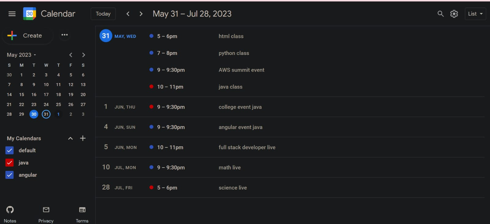

# Abhay-Calender-app

demo: lightmode / weekview

demo: darkmode / listview

Contact: abhaysingh0836481@outlook.com

[Live project link](https://er-abhay-fsd.github.io/Abhay-Calender-app/)

## Documentation

**This Documentation is a work in progress.**

I am currently working on a dev.to writeup that will follow more as a tutorial. If the feedback is positive, I will consider making a step by step tutorial in video format but it could potentially be around 10 hours long so I'm still gauging interest. Please let me know if you would be interested in this by contacting me directly via email (abhaysingh0836481@outlook.com).

____________

## Glossary

1. [About](#about)

2. [Cloning](#cloning)

3. [Journal](#journal)

4. [Cloning](#cloning)

5. [Events](#events)

6. [Drag_Systems](#drag_systems)
  
7. [Resize_Systems](#resize_systems)

8. [Date_Handling](#date_handling)

9. [Time_Handling](#time_handling)

10. [Form_Handling](#form_handling)

11. [Views](#views)

12. [Rendering](#rendering)

13. [Storage](#storage)

____________

## About

* Recreation of the google calendar app in its entirety (aside from components that utilize google apis).
* Zero third party resources used (aside from webpack & google-svgs)
* All code is written in vanilla javascript, html, and css.

At the moment, the application works using local storage but there are options to backup data and load previously saved data using json.

### Benchmarks & Features that differ from the original Google Calendar

* **Performance:**
  * Transfer size:
    * Google: 3MB.
    * Clone: 100kb.
  * Bundle Size (JS):
    * Google: 2.7MB.
    * Clone: 40kb.
  * Lighthouse:
    * Google: [77, 98, 92, 70].
    * Clone: [100, 100, 100, 100].
  * Responsive down to:
    * Google: 860px.
    * Clone: 280px.

* **Three themes:**
  * Dark.
  * High Contrast.
  * Light (same as google).

* **Keyboard Shortcuts:**
  * **Differ slightly from the original app.**
  * 29 in total.
  * New Shortcuts:
    * Toggle sidebar open/closed.
    * Open event and category forms.
    * Datepicker: set date to next&prev month/week.
    * Datepicker: set date to next&prev days.

* **Datepicker now has:**
  * Monthpicker.
  * Yearpicker.
  * Days with events are highlighted.
  * Current week highlighted when in weekview.

* **Download/Upload:**
  * All calendar events/categories/settings can be downloaded & uploaded.
    * Uploading data will overwrite existing data.

* **Other:**
  * Monthview cells are highlighted when dragged over.
  * Resize bar for week & day events.
  * 42 color options for categories.
  * Move all events from one category to another.
  * Single page. No page refreshes, no load times.
  * Aggressive memory handling.
  * At MAX there will be 8 active event listeners.
  * Sidebar converts to fixed positioning under 840px and main content inherits the full page width.
  * Turn animations/transitions on and off.
  * animation times adjusted.
  * Sorting animations for month/week/day view events.
  * Dayview header details how many entries are starting/ending on that day and the timeframes of first - last entry.
  * Yearview will automatically scroll to current selected month if not in view.
  * Yearview days with events are highlighted.
  * Dayview will automatically scroll to the top of first event if it is not in view.
  * Throttling optimized to always ensure content is visible during any keydown action.

____________

## Cloning

### `git clone`

### `Abhay-Calender-app`

### `npm install`

## Available_Scripts

### `npm run build`

Builds the app and **necessary** resources in the `dist` folder.

### `npm run dev`

Webpack: Starts development server on `localhost:3000`.

____________
